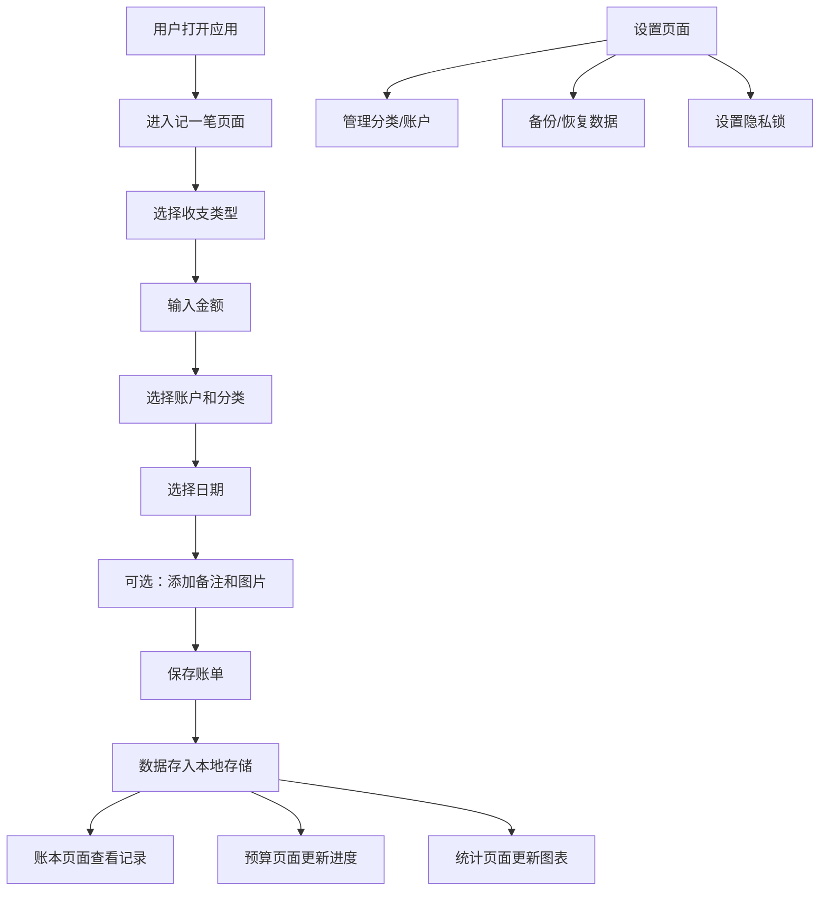

## 1. 产品概述

个人记账理财纯前端应用，帮助用户在浏览器中记录日常收支、管理预算、查看统计数据。所有数据本地存储，无需后端服务，保护用户隐私。

- 主要目的：提供便捷的个人财务管理工具，支持收支记录、预算管理、数据统计
- 目标用户：有个人理财需求的普通用户
- 产品价值：简洁易用、离线可用、数据安全、功能完善

## 2. 核心功能

### 2.1 用户角色

| 角色 | 注册方式 | 核心权限 |
|------|----------|----------|
| 普通用户 | 无需注册，直接使用 | 所有功能，数据本地存储 |

### 2.2 功能模块

1. **记一笔**：快速记录收入或支出，支持账户、分类、日期、备注、凭证图片
2. **账本**：查看所有账单记录，支持按月、分类、账户筛选，支持批量修改和删除
3. **预算**：设置月度总预算、分类限额，超支提醒
4. **统计**：收支趋势图、消费占比、账户余额、净资产变化
5. **设置**：分类管理、账户管理、周期账单、本地备份导入导出、隐私锁

### 2.3 页面详情

| 页面名称 | 模块名称 | 功能描述 |
|-----------|-------------|---------------------|
| 记一笔 | 收支类型切换 | 切换收入/支出类型 |
| 记一笔 | 金额输入 | 输入金额数字 |
| 记一笔 | 账户选择 | 选择资金账户（现金、银行卡、支付宝、微信等） |
| 记一笔 | 分类选择 | 选择收支分类（餐饮、交通、工资等） |
| 记一笔 | 日期选择 | 选择记录日期 |
| 记一笔 | 备注输入 | 添加文字备注 |
| 记一笔 | 凭证图片 | 上传/拍照凭证图片 |
| 账本 | 筛选栏 | 按月份、分类、账户筛选账单 |
| 账本 | 账单列表 | 显示账单记录，支持日期分组 |
| 账本 | 批量操作 | 多选、批量修改、批量删除 |
| 账本 | 单条操作 | 编辑、删除单条账单 |
| 预算 | 月度总预算 | 设置每月总预算金额 |
| 预算 | 分类限额 | 为各消费分类设置预算限额 |
| 预算 | 进度展示 | 显示预算使用进度条 |
| 预算 | 超支提醒 | 预算超支时醒目提醒 |
| 统计 | 收支趋势 | 折线图展示月度/周度收支趋势 |
| 统计 | 消费占比 | 饼图展示各分类消费占比 |
| 统计 | 账户余额 | 显示各账户当前余额 |
| 统计 | 净资产变化 | 展示净资产随时间变化 |
| 设置 | 分类管理 | 新增、编辑、删除收支分类 |
| 设置 | 账户管理 | 新增、编辑、删除资金账户 |
| 设置 | 周期账单 | 设置定期自动记账（如房租、工资） |
| 设置 | 数据备份 | 导出本地数据为JSON文件 |
| 设置 | 数据恢复 | 从JSON文件导入数据 |
| 设置 | 隐私锁 | 设置应用密码锁 |

## 3. 核心流程

用户打开应用后，默认进入"记一笔"页面，可快速添加收支记录。在"账本"页面查看和管理所有账单，在"预算"页面设置预算并监控消费，在"统计"页面查看财务数据分析，在"设置"页面管理基础数据和隐私。

## 4. 用户界面设计

### 4.1 设计风格

- **主色调**：深青色 (#0D9488) 作为主色，温暖的橙色 (#F97316) 作为强调色
- **辅助色**：收入用绿色 (#10B981)，支出用红色 (#EF4444)
- **中性色**：以 slate 色系为基础，从 slate-50 到 slate-900
- **按钮风格**：圆角大按钮 (rounded-xl)，带轻微阴影，悬停有缩放效果
- **字体**：使用"Noto Sans SC"作为主字体，支持中文显示；数字使用等宽字体
- **布局风格**：卡片式布局，顶部导航栏，底部 Tab 切换（移动端），左侧导航（桌面端）
- **图标风格**：使用 Lucide React 图标库，简洁线性风格

### 4.2 页面设计概览

| 页面名称 | 模块名称 | UI 元素 |
|-----------|-------------|-------------|
| 记一笔 | 表单区 | 渐变顶部栏、金额大字体输入、分类图标网格、日期选择器、卡片式表单 |
| 账本 | 列表区 | 筛选标签栏、日期分组标题、账单卡片、悬浮操作按钮 |
| 预算 | 进度区 | 预算总览卡片、分类进度条列表、超支警告提示 |
| 统计 | 图表区 | 多标签切换、折线图、饼图、数据卡片网格 |
| 设置 | 列表区 | 分组设置项、开关控件、模态框弹窗 |

### 4.3 响应式设计

- **桌面端优先**：采用两栏布局，左侧导航栏 + 右侧内容区
- **移动端适配**：底部 Tab 导航，内容区全屏显示
- **触控优化**：按钮最小高度 44px，列表项足够间距便于点击
- **断点**：sm (640px), md (768px), lg (1024px)

### 4.4 动效与交互

- 页面切换使用淡入淡出过渡
- 按钮悬停时轻微放大 + 阴影加深
- 表单提交成功时显示成功动画
- 列表项添加/删除有滑入滑出动画
- 预算超支时有呼吸灯警告效果
