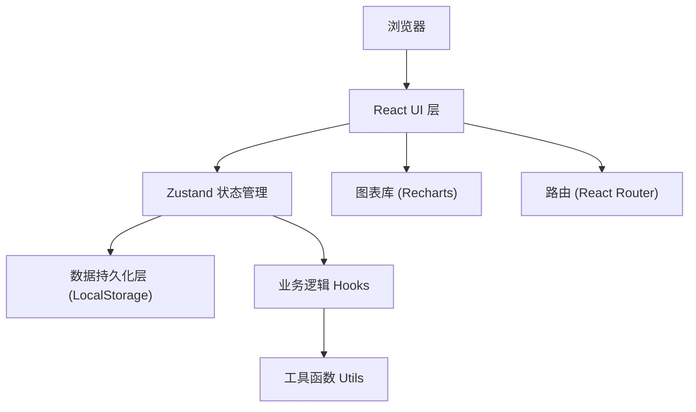
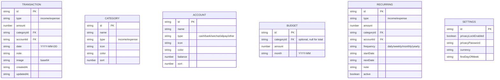

## 1. 架构设计



## 2. 技术描述

- **前端框架**：React@18 + TypeScript
- **构建工具**：Vite@5
- **样式方案**：TailwindCSS@3
- **状态管理**：Zustand@4
- **路由管理**：React Router DOM@6
- **图表库**：Recharts@2
- **图标库**：Lucide React@0.400
- **日期处理**：date-fns@3
- **数据存储**：浏览器 LocalStorage（纯前端，无后端）

## 3. 路由定义

| 路由路径 | 页面名称 | 说明 |
|----------|----------|------|
| / | 重定向 | 重定向到 /record |
| /record | 记一笔 | 快速录入收支记录 |
| /ledger | 账本 | 查看和管理所有账单 |
| /budget | 预算 | 设置和查看预算 |
| /statistics | 统计 | 数据统计和图表 |
| /settings | 设置 | 应用设置和数据管理 |

## 4. 数据模型

### 4.1 数据模型 ER 图



### 4.2 TypeScript 类型定义

```typescript
export type TransactionType = 'income' | 'expense';

export interface Transaction {
  id: string;
  type: TransactionType;
  amount: number;
  categoryId: string;
  accountId: string;
  date: string;
  note: string;
  image?: string;
  createdAt: string;
  updatedAt: string;
}

export interface Category {
  id: string;
  name: string;
  type: TransactionType;
  icon: string;
  color: string;
  sort: number;
}

export type AccountType = 'cash' | 'bank' | 'wechat' | 'alipay' | 'other';

export interface Account {
  id: string;
  name: string;
  type: AccountType;
  icon: string;
  color: string;
  balance: number;
  sort: number;
}

export interface Budget {
  id: string;
  categoryId: string | null;
  amount: number;
  month: string;
}

export type Frequency = 'daily' | 'weekly' | 'monthly' | 'yearly';

export interface Recurring {
  id: string;
  type: TransactionType;
  amount: number;
  categoryId: string;
  accountId: string;
  frequency: Frequency;
  startDate: string;
  nextDate: string;
  note: string;
  active: boolean;
}

export interface Settings {
  privacyLockEnabled: boolean;
  privacyPassword: string;
  currency: string;
  firstDayOfWeek: number;
}
```

## 5. 项目结构

```
src/
├── components/          # 通用组件
│   ├── Layout/          # 布局组件
│   ├── TransactionForm/ # 记账表单组件
│   ├── CategoryIcon/    # 分类图标组件
│   ├── AmountInput/     # 金额输入组件
│   ├── DatePicker/      # 日期选择组件
│   ├── Modal/           # 模态框组件
│   └── ProgressBar/     # 进度条组件
├── pages/               # 页面组件
│   ├── Record.tsx       # 记一笔
│   ├── Ledger.tsx       # 账本
│   ├── Budget.tsx       # 预算
│   ├── Statistics.tsx   # 统计
│   └── Settings.tsx     # 设置
├── store/               # Zustand 状态管理
│   └── useStore.ts      # 全局状态
├── hooks/               # 自定义 Hooks
│   ├── useTransactions.ts
│   ├── useCategories.ts
│   ├── useAccounts.ts
│   ├── useBudgets.ts
│   └── useRecurring.ts
├── utils/               # 工具函数
│   ├── storage.ts       # 本地存储
│   ├── date.ts          # 日期处理
│   ├── money.ts         # 金额格式化
│   └── export.ts        # 导入导出
├── types/               # 类型定义
│   └── index.ts
├── App.tsx
├── main.tsx
└── index.css
```

## 6. 初始数据

应用首次启动时，自动初始化以下默认数据：

**默认分类：**
- 支出：餐饮、交通、购物、娱乐、居住、医疗、教育、其他
- 收入：工资、奖金、投资、兼职、红包、其他

**默认账户：**
- 现金、银行卡、支付宝、微信钱包
